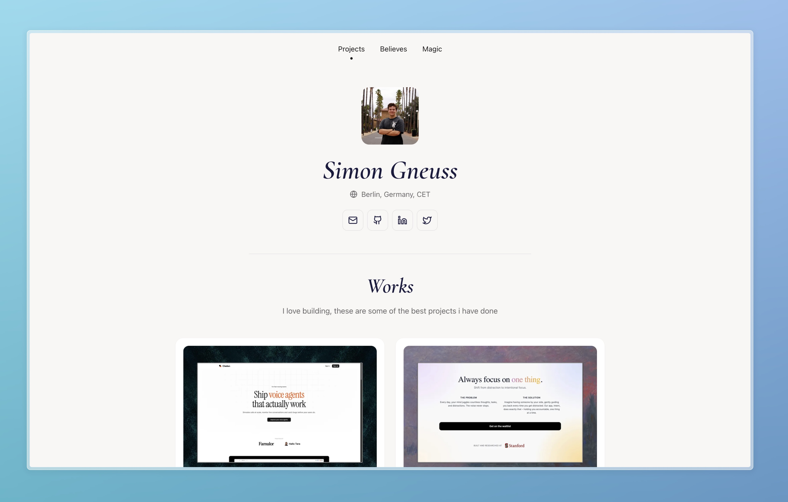

# Portfolio



Personal portfolio built with [Astro](https://astro.build).

## Commands

```bash
npm install      # Install dependencies
npm run dev      # Start dev server at localhost:4321
npm run build    # Build for production
npm run preview  # Preview production build
```

## Stack

- Astro 5
- TypeScript
- Scoped CSS
